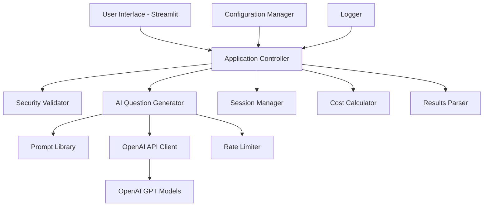

# Design Document

## Overview

The AI-Powered Interview Preparation Application is a single-page Streamlit web application that provides personalized interview question generation using OpenAI's GPT models. The application implements advanced prompt engineering techniques, real-time cost tracking, and comprehensive security measures while maintaining a simple, user-friendly interface for local development and testing.

## Architecture

### High-Level Architecture



### Component Interaction Flow

1. **User Input** → Security validation → Configuration
2. **Prompt Selection** → Template generation → API call preparation
3. **API Execution** → Rate limiting → Response handling
4. **Result Processing** → Cost calculation → UI display
5. **Session Management** → History tracking → State persistence

## Components and Interfaces

### 1. Core Application Components

#### InterviewPrepApp (main.py)
- **Purpose**: Main application orchestrator and Streamlit entry point
- **Responsibilities**:
  - Application initialization and configuration
  - Session state management
  - Error handling and recovery
  - UI coordination and flow control
- **Key Methods**:
  - `initialize()`: API key validation and component setup
  - `generate_questions()`: Orchestrates question generation workflow
  - `parse_structured_output()` / `parse_text_output()`: Response parsing

#### InterviewQuestionGenerator (src/ai/generator.py)
- **Purpose**: Core AI integration and question generation
- **Responsibilities**:
  - OpenAI API communication with retry logic
  - Prompt template application
  - Rate limiting enforcement
  - Response validation and error handling
- **Key Methods**:
  - `generate_questions()`: Main generation method with retry logic
  - `_get_prompt_template()`: Template selection based on interview type

#### PromptLibrary (src/ai/prompts.py)
- **Purpose**: Centralized prompt engineering implementation
- **Responsibilities**:
  - Five prompt technique implementations
  - Template management and formatting
  - Context-aware prompt selection
- **Techniques Implemented**:
  - Few-Shot Learning with examples
  - Chain-of-Thought with step-by-step reasoning
  - Zero-Shot direct generation
  - Role-Based with interviewer personas
  - Structured Output with JSON formatting

### 2. Utility Components

#### SecurityValidator (src/utils/security.py)
- **Purpose**: Input validation and security enforcement
- **Validation Rules**:
  - Length constraints (10-5000 characters)
  - Prompt injection pattern detection
  - HTML/script tag sanitization
  - Malicious content filtering

#### CostCalculator (src/utils/cost.py)
- **Purpose**: Real-time API cost calculation and tracking
- **Features**:
  - Model-specific pricing (GPT-4o, GPT-5)
  - Token-based cost breakdown
  - Cumulative session tracking
  - Cost transparency reporting

#### RateLimiter (src/utils/rate_limiter.py)
- **Purpose**: API call rate limiting and throttling
- **Configuration**:
  - 100 calls per hour default limit
  - Sliding window implementation
  - Reset time calculation
  - Remaining calls tracking

### 3. Data Models and Schemas

#### Pydantic Models (src/models/schemas.py)
```python
class AISettings(BaseModel):
    model: Literal["gpt-5", "gpt-4o"] = "gpt-4o"
    temperature: float = 0.7
    max_tokens: int = 2000
    top_p: float = 0.9
    frequency_penalty: float = 0.0

class InterviewSession:
    id: str
    timestamp: datetime
    job_description: str
    interview_type: InterviewType
    experience_level: ExperienceLevel
    ai_settings: AISettings
    results: Optional[InterviewResults]

class InterviewResults:
    questions: list[str]
    recommendations: list[str]
    cost_breakdown: dict[str, float]
    response_time: float
    model_used: str
    tokens_used: dict[str, int]
```

#### Enums (src/models/enums.py)
- `InterviewType`: Technical, Behavioral, Case Study, Reverse
- `ExperienceLevel`: Junior, Mid, Senior, Lead
- `PromptTechnique`: Five engineering techniques

### 4. User Interface Components

#### InterviewPrepUI (src/ui/components.py)
- **Purpose**: Streamlit UI component management
- **Components**:
  - Input section with job description, interview type, experience level
  - Advanced settings with model selection and prompt techniques
  - Results display with questions, recommendations, and cost metrics
  - Session history and debug information

## Data Models

### Input Data Flow
1. **User Input**: Job description (string, 10-5000 chars)
2. **Configuration**: Interview type, experience level, AI settings
3. **Security Processing**: Validation, sanitization, injection prevention
4. **Prompt Generation**: Template selection and variable substitution

### Output Data Structure
```python
{
    "questions": [
        "Generated interview question 1",
        "Generated interview question 2",
        # ... up to 20 questions
    ],
    "recommendations": [
        "Preparation recommendation 1",
        "Preparation recommendation 2",
        # ... strategic advice
    ],
    "cost_info": {
        "input_cost": 0.001250,
        "output_cost": 0.015000,
        "total_cost": 0.016250,
        "input_tokens": 1000,
        "output_tokens": 1500
    },
    "metadata": {
        "model_used": "gpt-4o",
        "technique": "chain_of_thought",
        "response_time": 3.45,
        "timestamp": "2025-01-09T10:30:00"
    }
}
```

### Session State Management
- **Current Results**: Active question set and cost information
- **Session History**: Up to 10 recent generation sessions
- **Usage Tracking**: API call count and cumulative costs
- **Error Logging**: Debug information and error traces

## Error Handling

### Error Categories and Responses

#### 1. Configuration Errors
- **Missing API Key**: Clear setup instructions with .env file guidance
- **Invalid API Key**: Format validation and troubleshooting steps
- **Environment Issues**: Dependency and configuration validation

#### 2. Input Validation Errors
- **Empty Input**: User-friendly prompt for job description
- **Length Violations**: Clear character count feedback
- **Security Violations**: Sanitization with explanation of blocked content

#### 3. API Integration Errors
- **Rate Limiting**: Automatic retry with exponential backoff (3 attempts)
- **Network Failures**: Graceful degradation with retry suggestions
- **Response Parsing**: Fallback parsing methods for malformed responses

#### 4. Runtime Errors
- **Memory Issues**: Graceful handling with resource cleanup
- **Session State Corruption**: Automatic recovery and state reset
- **Unexpected Exceptions**: Comprehensive logging with debug information

### Error Recovery Strategies
1. **Automatic Retry**: Exponential backoff for transient failures
2. **Fallback Parsing**: Multiple response parsing methods
3. **Graceful Degradation**: Partial functionality when components fail
4. **User Feedback**: Clear error messages with actionable guidance

## Testing Strategy

### 1. Unit Testing Framework
- **Framework**: pytest with asyncio support
- **Coverage**: All core components with >80% coverage target
- **Mocking**: OpenAI API responses for consistent testing

### 2. Integration Testing
- **API Integration**: Real OpenAI API calls with test keys
- **End-to-End Flows**: Complete user workflows from input to output
- **Error Scenarios**: Comprehensive failure mode testing

### 3. Security Testing
- **Input Validation**: Prompt injection and malicious input testing
- **Rate Limiting**: Boundary condition and overflow testing
- **Data Sanitization**: XSS and script injection prevention

### 4. Performance Testing
- **Response Times**: <10 second generation target
- **Memory Usage**: Efficient resource utilization
- **Concurrent Users**: Single-user local deployment focus

### 5. Manual Testing Checklist

#### Core Functionality Tests
1. **Question Generation**: All interview types and experience levels
2. **Prompt Techniques**: All 5 techniques with varied inputs
3. **Cost Calculation**: Accurate pricing for different models
4. **Session Management**: History tracking and state persistence

#### Security and Validation Tests
1. **Input Sanitization**: Malicious content filtering
2. **Rate Limiting**: Boundary testing and reset behavior
3. **API Key Validation**: Invalid and missing key scenarios

#### User Experience Tests
1. **UI Responsiveness**: Real-time updates and progress indicators
2. **Error Handling**: Clear messaging and recovery options
3. **Configuration**: Advanced settings and default behaviors

### 6. Test Data and Scenarios

#### Sample Job Descriptions
- **Technical Role**: "Senior Python Developer with Django, REST APIs, PostgreSQL experience"
- **Management Role**: "Product Manager for e-commerce platform with team leadership"
- **Entry Level**: "Junior Software Developer, recent graduate, JavaScript focus"

#### Expected Outputs
- **Question Relevance**: Job-specific technical and behavioral questions
- **Difficulty Scaling**: Appropriate complexity for experience level
- **Cost Accuracy**: Precise token counting and pricing calculation

### 7. Deployment and Environment Testing
- **Local Development**: Streamlit server on localhost:8501
- **Environment Variables**: .env file configuration and validation
- **Dependency Management**: Virtual environment and package installation
- **Cross-Platform**: Windows development environment compatibility

This comprehensive design provides a robust foundation for implementing the AI Interview Prep Application with all required features, security measures, and testing strategies while maintaining simplicity for local development and manual testing.